# Feature Engineering in MLOps Pipeline

This document provides a comprehensive guide to feature engineering in the taxi fare prediction MLOps pipeline, covering how features are computed, stored, and used across different stages of the machine learning lifecycle.

## 📋 Table of Contents

1. [Overview](#overview)
2. [Feature Engineering Architecture](#feature-engineering-architecture)
3. [Feature Development & Computation](#feature-development--computation)
4. [Feature Storage & Versioning](#feature-storage--versioning)
5. [Features in Model Training](#features-in-model-training)
6. [Features in Real-time Serving](#features-in-real-time-serving)
7. [Features in Batch Inference](#features-in-batch-inference)
8. [Feature Monitoring & Observability](#feature-monitoring--observability)
9. [Best Practices](#best-practices)

## 🎯 Overview

The feature engineering system in this MLOps pipeline is built on **Databricks Unity Catalog Feature Store**, providing:

- **Centralized Feature Management**: All features stored in Unity Catalog with governance
- **Time-series Features**: Sliding window aggregations for taxi trip patterns
- **Real-time Serving**: Sub-millisecond feature lookup via online tables
- **Feature Reuse**: Same features used in training and inference
- **Data Lineage**: Complete traceability from raw data to model predictions

### Key Technologies
- **Databricks Feature Store** (Unity Catalog-based)
- **Delta Lake** for feature table storage
- **Online Tables** for real-time serving
- **Apache Spark** for large-scale feature computation
- **Feature Engineering Client** for Unity Catalog integration

## 🏗️ Feature Engineering Architecture

```
┌─────────────────────────────────────────────────────────────────┐
│                    FEATURE ENGINEERING LIFECYCLE                │
├─────────────────────────────────────────────────────────────────┤
│                                                                 │
│  RAW DATA                FEATURE COMPUTATION         STORAGE    │
│  ┌─────────────┐        ┌─────────────────────┐    ┌─────────── │
│  │ NYC Taxi    │   ──>  │ pickup_features.py  │──> │ Unity      │
│  │ Trip Data   │        │ - Window aggregates │    │ Catalog    │
│  │ (Delta Lake)│        │ - Time-based        │    │ Feature    │
│  └─────────────┘        │   computations      │    │ Store      │
│                         │                     │    │            │
│                         │ dropoff_features.py │    │ ┌────────  │
│                         │ - Location stats    │    │ │ Offline  │
│                         │ - Weekend detection │    │ │ Tables   │
│                         └─────────────────────┘    │ │ (Delta)  │
│                                                    │ └────────  │
│  FEATURE SERVING                                   │            │
│  ┌─────────────────────────────────────────────┐  │ ┌────────  │
│  │              TRAINING                       │  │ │ Online   │
│  │  ┌─────────────────────────────────────┐    │  │ │ Tables   │
│  │  │ FeatureLookup + TrainingSet         │<───┼──┤ │ (Real-   │
│  │  │ - Automatic feature joining         │    │  │ │  time)   │
│  │  │ - Point-in-time correctness         │    │  │ └────────  │
│  │  └─────────────────────────────────────┘    │  │            │
│  └─────────────────────────────────────────────┘  └─────────── │
│                                                                 │
│  ┌─────────────────────────────────────────────┐               │
│  │            REAL-TIME SERVING                │               │
│  │  ┌─────────────────────────────────────┐    │               │
│  │  │ Serving Endpoint + Online Tables    │<───┼───────────────┤
│  │  │ - Sub-millisecond feature lookup    │    │               │
│  │  │ - Automatic feature enrichment      │    │               │
│  │  └─────────────────────────────────────┘    │               │
│  └─────────────────────────────────────────────┘               │
│                                                                 │
│  ┌─────────────────────────────────────────────┐               │
│  │             BATCH INFERENCE                 │               │
│  │  ┌─────────────────────────────────────┐    │               │
│  │  │ Batch Feature Lookup + Scoring      │<───┼───────────────┤
│  │  │ - Large-scale feature joining       │    │               │
│  │  │ - Historical feature access         │    │               │
│  │  └─────────────────────────────────────┘    │               │
│  └─────────────────────────────────────────────┘               │
└─────────────────────────────────────────────────────────────────┘
```

### 🔄 Feature Store Client Sequence Flow

The following sequence diagram illustrates how the Databricks Feature Engineering Client orchestrates feature operations during training and inference:

```mermaid
sequenceDiagram
    participant TE as Training Engineer
    participant FS as Feature Store Client
    participant UC as Unity Catalog
    participant OT as Online Tables
    participant ML as MLflow Registry
    participant SE as Serving Endpoint
    participant API as API Client

    Note over TE, API: TRAINING TIME FLOW
    
    TE->>FS: 1. Create FeatureLookup specs
    Note right of TE: pickup_feature_lookups<br/>+ dropoff_feature_lookups
    
    TE->>FS: 2. fe.create_training_set(df, feature_lookups, label)
    FS->>UC: 3. Query feature tables with point-in-time joins
    Note right of UC: trip_pickup_features<br/>+ trip_dropoff_features
    UC-->>FS: 4. Return joined training data
    FS-->>TE: 5. Training set with features
    
    TE->>TE: 6. Train model (LightGBM)
    Note right of TE: model = lgb.train(training_df)
    
    TE->>FS: 7. fe.log_model(model, training_set, model_name)
    FS->>ML: 8. Store model + feature metadata
    Note right of ML: Model artifacts +<br/>FeatureLookup specs +<br/>Training set config
    ML-->>FS: 9. Model URI
    FS-->>TE: 10. Registered model ready

    Note over TE, API: DEPLOYMENT TIME FLOW
    
    TE->>FS: 11. create_online_tables()
    FS->>UC: 12. Create OnlineTableSpec
    UC->>OT: 13. Sync feature tables → online tables
    Note right of OT: trip_pickup_features_online<br/>+ trip_dropoff_features_online
    OT-->>UC: 14. Online tables ready
    UC-->>FS: 15. Online table status
    
    TE->>SE: 16. Deploy serving endpoint with model_uri
    SE->>ML: 17. Load model + embedded feature specs
    ML-->>SE: 18. Model + FeatureLookup metadata
    SE-->>TE: 19. Serving endpoint ready

    Note over TE, API: INFERENCE TIME FLOW
    
    API->>SE: 20. POST /predict with raw data
    Note right of API: {"pickup_zip": "10001",<br/>"dropoff_zip": "10002",<br/>"pickup_datetime": "...",<br/>"trip_distance": 2.5}
    
    SE->>SE: 21. Apply embedded preprocessing
    Note right of SE: Round timestamps using<br/>training_set metadata:<br/>pickup: 15min, dropoff: 30min
    
    par Parallel Feature Lookup
        SE->>OT: 22a. Lookup pickup features
        Note right of SE: Query: pickup_zip + rounded_pickup_datetime
        OT-->>SE: 23a. Pickup feature values
        Note left of OT: mean_fare_window_1h_pickup_zip<br/>count_trips_window_1h_pickup_zip
    and
        SE->>OT: 22b. Lookup dropoff features  
        Note right of SE: Query: dropoff_zip + rounded_dropoff_datetime
        OT-->>SE: 23b. Dropoff feature values
        Note left of OT: count_trips_window_30m_dropoff_zip<br/>dropoff_is_weekend
    end
    
    SE->>SE: 24. Assemble feature vector
    Note right of SE: Combine raw input +<br/>retrieved features in<br/>training order
    
    SE->>SE: 25. Model.predict(feature_vector)
    Note right of SE: LightGBM inference
    
    SE-->>API: 26. Return prediction
    Note left of SE: {"predictions": [14.75]}

    Note over TE, API: FEATURE CONSISTENCY GUARANTEES
    
    rect rgb(240, 248, 255)
        Note over FS, ML: Training Set Metadata Embedding
        FS->>ML: ✓ FeatureLookup specifications
        FS->>ML: ✓ Preprocessing requirements (timestamp rounding)
        FS->>ML: ✓ Feature table schema & online table mapping
        FS->>ML: ✓ Feature ordering & data types
    end
    
    rect rgb(240, 255, 240)
        Note over SE, OT: Automatic Inference Pipeline
        SE->>SE: ✓ Same preprocessing logic as training
        SE->>OT: ✓ Same feature lookup specifications
        SE->>SE: ✓ Same feature vector assembly order
        SE->>SE: ✓ Built-in fallbacks for missing features
    end

    rect rgb(255, 248, 240)
        Note over UC, OT: Real-time Feature Serving
        UC->>OT: ✓ Sub-millisecond feature lookup
        UC->>OT: ✓ Automatic sync from offline tables
        UC->>OT: ✓ Change Data Feed for incremental updates
        UC->>OT: ✓ High availability with failover
    end
```



### 🔍 Key Sequence Flow Insights

#### **Training Time (Steps 1-10)**
- **Feature Store Client** automatically handles point-in-time joins with feature tables
- **Training set creation** embeds all feature engineering specifications as metadata
- **Model logging** packages both the trained model AND the feature pipeline specifications

#### **Deployment Time (Steps 11-19)**  
- **Online tables** are created from offline feature tables for real-time serving
- **Serving endpoint** loads model with embedded feature specifications
- **No additional configuration** needed - everything is stored in model metadata

#### **Inference Time (Steps 20-26)**
- **Automatic preprocessing** uses the exact same logic from training (timestamp rounding)
- **Parallel feature lookup** queries multiple online tables concurrently for optimal latency
- **Feature vector assembly** maintains the same order and structure as training data

#### **Consistency Guarantees**
- **Zero-code consistency**: Same preprocessing and feature lookup logic automatically
- **Metadata-driven pipeline**: All specifications stored with model, not in separate configs
- **Real-time feature serving**: Sub-millisecond lookup with automatic synchronization

This sequence flow ensures **perfect training-serving consistency** while providing **high-performance real-time inference** with **zero manual configuration** at serving time.

## 🔬 Feature Development & Computation

### Feature Modules Structure

The feature engineering logic is organized into modular components:

```
feature_engineering/
├── features/
│   ├── pickup_features.py      # Pickup location feature logic
│   └── dropoff_features.py     # Dropoff location feature logic
├── notebooks/
│   └── GenerateAndWriteFeatures.py  # Feature pipeline execution
└── feature_engineering_utils.py     # Shared utilities
```

### Pickup Location Features

**File**: `feature_engineering/features/pickup_features.py`

**Features Computed**:
- `mean_fare_window_1h_pickup_zip`: Average fare amount in pickup location over 1-hour sliding window
- `count_trips_window_1h_pickup_zip`: Number of trips from pickup location in 1-hour window

**Implementation Details**:
```python
def compute_features_fn(input_df, timestamp_column, start_date, end_date):
    """
    Computes pickup location features using sliding window aggregations.
    
    Window Configuration:
    - Window Size: 1 hour
    - Slide Interval: 15 minutes (overlapping windows)
    - Aggregations: Mean fare, Trip count
    """
    pickupzip_features = (
        df.groupBy(
            "pickup_zip", 
            F.window(timestamp_column, "1 hour", "15 minutes")
        )
        .agg(
            F.mean("fare_amount").alias("mean_fare_window_1h_pickup_zip"),
            F.count("*").alias("count_trips_window_1h_pickup_zip"),
        )
        # Transform to feature store format with primary keys
        .select(
            F.col("pickup_zip").alias("zip"),
            F.unix_timestamp(F.col("window.end"))
            .alias(timestamp_column)
            .cast(TimestampType()),
            F.col("mean_fare_window_1h_pickup_zip").cast(FloatType()),
            F.col("count_trips_window_1h_pickup_zip").cast(IntegerType()),
        )
    )
    return pickupzip_features
```

**Primary Keys**: `["pickup_zip", "rounded_pickup_datetime"]`

### Dropoff Location Features  

**File**: `feature_engineering/features/dropoff_features.py`

**Features Computed**:
- `count_trips_window_30m_dropoff_zip`: Number of trips to dropoff location in 30-minute window
- `dropoff_is_weekend`: Boolean indicating if dropoff occurred on weekend

**Implementation Details**:
```python
@F.udf(returnType=IntegerType())
def _is_weekend(dt):
    """Detect weekend dropoffs using New York timezone"""
    tz = "America/New_York"
    return int(dt.astimezone(timezone(tz)).weekday() >= 5)

def compute_features_fn(input_df, timestamp_column, start_date, end_date):
    """
    Computes dropoff location features with time-based aggregations.
    
    Window Configuration:
    - Window Size: 30 minutes (non-overlapping)
    - Aggregations: Trip count, Weekend detection
    """
    dropoffzip_features = (
        df.groupBy("dropoff_zip", F.window(timestamp_column, "30 minute"))
        .agg(F.count("*").alias("count_trips_window_30m_dropoff_zip"))
        .select(
            F.col("dropoff_zip").alias("zip"),
            F.unix_timestamp(F.col("window.end")).alias(timestamp_column),
            F.col("count_trips_window_30m_dropoff_zip").cast(IntegerType()),
            _is_weekend(F.col("window.end")).alias("dropoff_is_weekend"),
        )
    )
    return dropoffzip_features
```

**Primary Keys**: `["dropoff_zip", "rounded_dropoff_datetime"]`

### Feature Pipeline Execution

**File**: `feature_engineering/notebooks/GenerateAndWriteFeatures.py`

**Purpose**: Orchestrates feature computation and writes to Feature Store

**Process**:
1. **Load Raw Data**: Read NYC taxi trip data from Delta Lake
2. **Dynamic Module Loading**: Import feature computation modules
3. **Execute Feature Functions**: Call `compute_features_fn` for each module
4. **Write to Feature Store**: Persist features with proper schema and partitioning
5. **Enable Change Data Feed**: Configure for online table synchronization

**Key Parameters**:
- `input_table_path`: Source data location  
- `output_table_name`: Target feature table name
- `primary_keys`: Primary key columns for feature store
- `timestamp_column`: Timestamp for time-series features
- `features_transform_module`: Feature computation module to use

## 📊 Feature Storage & Versioning

### Unity Catalog Feature Tables

Features are stored as Delta Lake tables in Unity Catalog with the following structure:

#### **Pickup Features Table**
**Table Name**: `p03.e2e_demo_simon.trip_pickup_features`

| Column | Data Type | Description |
|--------|-----------|-------------|
| `pickup_zip` | String | Pickup location ZIP code (Primary Key) |
| `rounded_pickup_datetime` | Timestamp | Rounded pickup time (Primary Key) |
| `mean_fare_window_1h_pickup_zip` | Float | Average fare in 1-hour window |
| `count_trips_window_1h_pickup_zip` | Integer | Trip count in 1-hour window |
| `yyyy_mm` | String | Partition key (YYYY-MM format) |

#### **Dropoff Features Table**  
**Table Name**: `p03.e2e_demo_simon.trip_dropoff_features`

| Column | Data Type | Description |
|--------|-----------|-------------|
| `dropoff_zip` | String | Dropoff location ZIP code (Primary Key) |
| `rounded_dropoff_datetime` | Timestamp | Rounded dropoff time (Primary Key) |
| `count_trips_window_30m_dropoff_zip` | Integer | Trip count in 30-minute window |
| `dropoff_is_weekend` | Integer | Weekend indicator (0/1) |
| `yyyy_mm` | String | Partition key (YYYY-MM format) |

### Data Partitioning Strategy

Features are partitioned by `yyyy_mm` for optimal query performance:
- **Partition Granularity**: Monthly partitions
- **Query Optimization**: Time-range queries leverage partition pruning
- **Storage Efficiency**: Old partitions can be archived or deleted
- **Parallel Processing**: Multiple partitions can be processed concurrently

### Change Data Feed (CDC)

**Purpose**: Enables incremental updates to online tables

**Configuration**:
```sql
-- Enable CDC on feature tables
ALTER TABLE p03.e2e_demo_simon.trip_pickup_features 
SET TBLPROPERTIES (delta.enableChangeDataFeed = true);

ALTER TABLE p03.e2e_demo_simon.trip_dropoff_features 
SET TBLPROPERTIES (delta.enableChangeDataFeed = true);
```

**Benefits**:
- **Real-time Sync**: Changes propagate to online tables automatically
- **Efficient Updates**: Only changed records are synchronized
- **Audit Trail**: Complete history of feature changes is maintained

## 🎯 Features in Model Training

### Feature Lookup Configuration

During training, features are automatically joined with training data using **FeatureLookup** specifications:

```python
from databricks.feature_engineering import FeatureLookup, FeatureEngineeringClient

# Define feature lookups with point-in-time correctness
pickup_feature_lookups = [
    FeatureLookup(
        table_name="p03.e2e_demo_simon.trip_pickup_features",
        feature_names=[
            "mean_fare_window_1h_pickup_zip",
            "count_trips_window_1h_pickup_zip",
        ],
        lookup_key=["pickup_zip"],                    # Join key
        timestamp_lookup_key=["rounded_pickup_datetime"],  # Temporal join
    ),
]

dropoff_feature_lookups = [
    FeatureLookup(
        table_name="p03.e2e_demo_simon.trip_dropoff_features", 
        feature_names=["count_trips_window_30m_dropoff_zip", "dropoff_is_weekend"],
        lookup_key=["dropoff_zip"],
        timestamp_lookup_key=["rounded_dropoff_datetime"],
    ),
]
```

### Training Set Creation

**Point-in-Time Correctness**: Features are joined based on temporal relationships to prevent data leakage:

```python
# Initialize Feature Engineering Client
fe = FeatureEngineeringClient()

# Create training set with automatic feature joining
training_set = fe.create_training_set(
    df=taxi_data,                                          # Base training data
    feature_lookups=pickup_feature_lookups + dropoff_feature_lookups,  # Feature specs
    label="fare_amount",                                   # Target variable
    exclude_columns=["rounded_pickup_datetime", "rounded_dropoff_datetime"],  # Exclude timestamp keys
)

# Load complete dataset with features
training_df = training_set.load_df()
```

### Feature Lineage & Metadata

The Feature Store automatically tracks:
- **Data Lineage**: Source tables → Feature tables → Training datasets → Models
- **Feature Metadata**: Computation logic, data types, update frequency
- **Usage Tracking**: Which models use which features
- **Version History**: Feature schema evolution over time

### Training Data Schema

After feature joining, the training dataset contains:

| Column | Source | Type | Description |
|--------|--------|------|-------------|
| `pickup_zip` | Raw data | String | Pickup location |
| `dropoff_zip` | Raw data | String | Dropoff location |
| `trip_distance` | Raw data | Double | Trip distance in miles |
| `fare_amount` | Raw data | Double | **Target variable** |
| `mean_fare_window_1h_pickup_zip` | **Feature Store** | Float | Avg fare at pickup location |
| `count_trips_window_1h_pickup_zip` | **Feature Store** | Integer | Trip count at pickup |
| `count_trips_window_30m_dropoff_zip` | **Feature Store** | Integer | Trip count at dropoff |
| `dropoff_is_weekend` | **Feature Store** | Integer | Weekend indicator |

### 📦 Feature Engineering Logic Packaging & Deployment

**Critical Challenge**: How does the model at inference time access the same feature engineering logic used during training?

#### **Method 1: MLflow Model Packaging (Recommended)**

MLflow can package feature engineering code directly with the model, ensuring the exact same logic is available at inference time:

```python
# training/notebooks/TrainWithFeatureStore.py
import mlflow
import mlflow.sklearn
from feature_engineering.feature_engineering_utils import add_rounded_timestamps

class TaxiFareModelWithPreprocessing(mlflow.pyfunc.PythonModel):
    """
    Custom MLflow model that includes feature engineering preprocessing.
    
    This ensures the SAME feature engineering logic travels with the model.
    """
    
    def __init__(self, model, feature_engineering_config):
        self.model = model
        self.config = feature_engineering_config
        
    def predict(self, context, model_input):
        """
        Prediction method that includes feature engineering.
        
        Args:
            context: MLflow context (contains artifacts)
            model_input: Raw input data (pandas DataFrame)
            
        Returns:
            Predictions with automatic feature enrichment
        """
        # Step 1: Apply SAME preprocessing as training
        spark = SparkSession.builder.getOrCreate()
        
        # Convert pandas to Spark for consistent processing
        spark_df = spark.createDataFrame(model_input)
        
        # Apply IDENTICAL timestamp rounding (packaged with model)
        preprocessed_df = add_rounded_timestamps(
            spark_df,
            pickup_minutes=self.config["pickup_rounding_minutes"],
            dropoff_minutes=self.config["dropoff_rounding_minutes"]
        )
        
        # Step 2: Feature lookup from online tables
        enriched_features = self._lookup_online_features(preprocessed_df)
        
        # Step 3: Model prediction
        return self.model.predict(enriched_features)
    
    def _lookup_online_features(self, preprocessed_df):
        """Lookup features from online tables using preprocessed timestamps."""
        # Implementation details for online feature lookup
        pass

# Package model WITH feature engineering code
def log_model_with_preprocessing(model, training_config):
    """
    Log model to MLflow with embedded feature engineering logic.
    """
    # Create wrapper that includes preprocessing
    model_wrapper = TaxiFareModelWithPreprocessing(
        model=model,
        feature_engineering_config=training_config
    )
    
    # Package feature engineering utilities as model artifacts
    artifacts = {
        "feature_utils": "feature_engineering/feature_engineering_utils.py",
        "config": training_config
    }
    
    # Log to MLflow with preprocessing embedded
    mlflow.pyfunc.log_model(
        artifact_path="taxi_fare_model",
        python_model=model_wrapper,
        artifacts=artifacts,
        conda_env={
            "dependencies": [
                "python=3.9",
                "pyspark==3.5.0", 
                "pandas>=1.5.0",
                "databricks-feature-engineering>=0.13.0"
            ]
        }
    )
    
    return mlflow.get_artifact_uri("taxi_fare_model")
```

#### **Method 2: Databricks Feature Engineering Client Integration**

Databricks provides native integration where feature engineering logic is embedded in model metadata:

```python
# During model training
from databricks.feature_engineering import FeatureEngineeringClient

fe = FeatureEngineeringClient()

# Log model WITH feature lookup specifications
# YOUR PIPELINE USES THIS APPROACH (Method 2) ✅
fe.log_model(
    model=model,                                    # Trained LightGBM model
    artifact_path="model_packaged",                 # Model artifact path
    flavor=mlflow.lightgbm,                       # LightGBM flavor (not sklearn)
    training_set=training_set,                      # CRITICAL: Embeds feature engineering specs
    registered_model_name=model_name               # Unity Catalog model name
)

# At inference time - model automatically knows how to do feature lookup
loaded_model = fe.load_model(model_uri="models:/taxi_fare_prediction_model/6")

# Model.predict() automatically:
# 1. Applies same preprocessing (from training_set metadata)
# 2. Looks up features from online tables 
# 3. Assembles feature vector in correct order
# 4. Makes prediction
predictions = loaded_model.predict(raw_inference_data)

## 🔍 **How Feature Engineering Logic Gets Embedded in Model Metadata**

When you call `fe.log_model(training_set=training_set)`, the **`training_set` object contains all the feature engineering specifications** that get embedded as model metadata:

### **What Gets Stored in Model Metadata:**

#### **1. Feature Lookup Specifications**
```python
# These FeatureLookup objects from your training are stored as metadata:
pickup_feature_lookups = [
    FeatureLookup(
        table_name="p03.e2e_demo_simon.trip_pickup_features",
        feature_names=["mean_fare_window_1h_pickup_zip", "count_trips_window_1h_pickup_zip"],
        lookup_key=["pickup_zip"],
        timestamp_lookup_key=["rounded_pickup_datetime"],  # Preprocessing logic embedded
    )
]

dropoff_feature_lookups = [
    FeatureLookup(
        table_name="p03.e2e_demo_simon.trip_dropoff_features", 
        feature_names=["count_trips_window_30m_dropoff_zip", "dropoff_is_weekend"],
        lookup_key=["dropoff_zip"],
        timestamp_lookup_key=["rounded_dropoff_datetime"],  # Preprocessing logic embedded
    )
]
```

#### **2. Training Set Configuration**
```python
# This configuration from training_set creation gets stored:
training_set_metadata = {
    "feature_lookups": pickup_feature_lookups + dropoff_feature_lookups,
    "label": "fare_amount",
    "exclude_columns": ["rounded_pickup_datetime", "rounded_dropoff_datetime"],
    "preprocessing_requirements": {
        # Inferred from timestamp_lookup_key usage
        "requires_rounded_pickup_datetime": True,
        "requires_rounded_dropoff_datetime": True,
        "pickup_rounding_interval": "15 minutes",  # From feature table metadata
        "dropoff_rounding_interval": "30 minutes"  # From feature table metadata
    }
}
```

#### **3. Feature Store Schema Information**
```python
# Schema and data type information gets embedded:
feature_schema_metadata = {
    "p03.e2e_demo_simon.trip_pickup_features": {
        "primary_keys": ["pickup_zip", "rounded_pickup_datetime"],
        "feature_columns": {
            "mean_fare_window_1h_pickup_zip": "float",
            "count_trips_window_1h_pickup_zip": "integer"
        },
        "online_table": "p03.e2e_demo_simon.trip_pickup_features_online"
    },
    "p03.e2e_demo_simon.trip_dropoff_features": {
        "primary_keys": ["dropoff_zip", "rounded_dropoff_datetime"], 
        "feature_columns": {
            "count_trips_window_30m_dropoff_zip": "integer",
            "dropoff_is_weekend": "integer"
        },
        "online_table": "p03.e2e_demo_simon.trip_dropoff_features_online"
    }
}
```

### **How This Metadata Enables Automatic Inference:**

#### **Step 1: Model Loading Reconstructs Feature Pipeline**
```python
# When you load the model with fe.load_model()
loaded_model = fe.load_model(model_uri)

# Internally, the FeatureEngineeringClient:
# 1. Reads the stored training_set metadata
# 2. Reconstructs the FeatureLookup specifications
# 3. Identifies required preprocessing (timestamp rounding)
# 4. Maps online table connections
```

#### **Step 2: Automatic Preprocessing at Inference**
```python
# When you call loaded_model.predict(raw_data)
# The model automatically applies the SAME preprocessing pipeline:

def embedded_preprocessing_pipeline(raw_inference_data):
    """
    This logic is automatically reconstructed from training_set metadata.
    """
    # Apply timestamp rounding (inferred from timestamp_lookup_key requirements)
    preprocessed_data = add_rounded_timestamps(
        raw_inference_data,
        pickup_minutes=15,   # From training_set metadata
        dropoff_minutes=30   # From training_set metadata
    )
    
    # The preprocessing parameters (15, 30) are derived from the
    # feature table configurations used during training
    return preprocessed_data
```

#### **Step 3: Automatic Feature Lookup**
```python
# The model uses embedded FeatureLookup specs to query online tables:

def embedded_feature_lookup_pipeline(preprocessed_data):
    """
    Feature lookup pipeline reconstructed from training_set metadata.
    """
    enriched_features = {}
    
    # Execute each FeatureLookup from training_set metadata
    for feature_lookup in training_set_metadata["feature_lookups"]:
        if feature_lookup.table_name == "trip_pickup_features":
            # Query online table using embedded specifications
            pickup_features = query_online_table(
                table="p03.e2e_demo_simon.trip_pickup_features_online",
                lookup_keys={
                    "pickup_zip": preprocessed_data["pickup_zip"],
                    "rounded_pickup_datetime": preprocessed_data["rounded_pickup_datetime"]
                },
                feature_names=feature_lookup.feature_names
            )
            enriched_features.update(pickup_features)
    
    return enriched_features
```

### **Complete Embedded Pipeline Execution:**

```python
# This entire pipeline runs automatically when you call model.predict()
def automatic_inference_pipeline(raw_input):
    """
    Complete pipeline reconstructed from model metadata.
    """
    # Step 1: Apply preprocessing (from training_set requirements)
    preprocessed = apply_embedded_preprocessing(raw_input)
    
    # Step 2: Feature lookup (from FeatureLookup specs) 
    features = apply_embedded_feature_lookup(preprocessed)
    
    # Step 3: Feature vector assembly (from training schema)
    feature_vector = assemble_feature_vector(raw_input, features)
    
    # Step 4: Model prediction (original trained model)
    prediction = trained_model.predict(feature_vector)
    
    return prediction

# All of this happens automatically - no additional code needed!
predictions = loaded_model.predict(raw_inference_data)
```

### **Key Benefits of This Approach:**

✅ **Zero-Code Inference**: No need to manually implement preprocessing or feature lookup  
✅ **Perfect Consistency**: Same logic guaranteed between training and serving  
✅ **Automatic Updates**: If feature tables update, online lookups get fresh data  
✅ **Schema Evolution**: Model adapts to compatible feature schema changes  
✅ **Error Handling**: Built-in fallbacks for missing features or lookup failures  

**This is why Method 2 (Databricks Feature Engineering Client) is so powerful** - the `training_set` object acts as a "blueprint" that gets stored with the model, enabling completely automatic feature engineering at inference time!
```

#### **Method 3: Shared Code Deployment**

Deploy feature engineering utilities alongside serving infrastructure:

```python
# deployment/model_deployment/deploy.py
def deploy_with_feature_engineering():
    """
    Deploy model with feature engineering utilities to serving environment.
    """
    
    # 1. Package feature engineering code
    feature_engineering_package = create_code_package([
        "feature_engineering/feature_engineering_utils.py",
        "feature_engineering/features/pickup_features.py", 
        "feature_engineering/features/dropoff_features.py"
    ])
    
    # 2. Deploy to serving cluster with model
    serving_endpoint = EndpointCoreConfigInput(
        name="taxi-fare-serving-endpoint",
        served_entities=[
            ServedEntityInput(
                entity_name="taxi_fare_prediction_model",
                entity_version="6",
                workload_size="Small",
                scale_to_zero_enabled=True,
                environment_vars={
                    # Include feature engineering config
                    "PICKUP_ROUNDING_MINUTES": "15",
                    "DROPOFF_ROUNDING_MINUTES": "30",
                    "FEATURE_ENGINEERING_VERSION": "v1.2.3"
                }
            )
        ]
    )
    
    # 3. Model serving code imports utilities
    """
    # In serving environment: 
    from feature_engineering_utils import add_rounded_timestamps
    
    def score_model(model_input):
        # Same preprocessing as training
        preprocessed = add_rounded_timestamps(model_input, 15, 30)
        # ... rest of inference pipeline
    """
    
    return workspace.serving_endpoints.create_and_wait(endpoint_config=serving_endpoint)
```

#### **Method 4: Docker Container Packaging**

Package everything together in a Docker container:

```dockerfile
# Dockerfile for model serving with feature engineering
FROM databricks/runtime:13.3-ML

# Copy feature engineering utilities
COPY feature_engineering/ /app/feature_engineering/
COPY deployment/model_deployment/ /app/deployment/

# Install dependencies
RUN pip install databricks-feature-engineering>=0.13.0

# Set working directory
WORKDIR /app

# Model serving entrypoint includes feature engineering
CMD ["python", "deployment/serve_model_with_features.py"]
```

```python
# deployment/serve_model_with_features.py
from feature_engineering.feature_engineering_utils import add_rounded_timestamps
import mlflow

class ModelServingWithFeatures:
    def __init__(self):
        # Load model
        self.model = mlflow.pyfunc.load_model("models:/taxi_fare_prediction_model/6")
        
        # Feature engineering config (same as training)
        self.config = {
            "pickup_rounding_minutes": 15,
            "dropoff_rounding_minutes": 30
        }
    
    def predict(self, request_data):
        # Apply SAME feature engineering as training
        preprocessed = self._preprocess_request(request_data)
        enriched = self._lookup_features(preprocessed)
        return self.model.predict(enriched)
    
    def _preprocess_request(self, request_data):
        # Uses IDENTICAL logic from training pipeline
        return add_rounded_timestamps(
            request_data, 
            **self.config
        )
```

#### **Best Practice: Hybrid Approach**

**Recommended Architecture**:
1. **MLflow Model Packaging**: Embed core feature engineering logic with model
2. **Shared Utilities**: Deploy common utilities to serving environment
3. **Configuration Management**: Centralize feature engineering parameters
4. **Validation Pipeline**: Ensure consistency across environments

```python
# Complete deployment strategy
def deploy_model_with_feature_consistency():
    """
    Deploy model ensuring feature engineering consistency.
    """
    
    # 1. Package model with preprocessing logic
    model_uri = log_model_with_preprocessing(trained_model, feature_config)
    
    # 2. Create online tables for feature serving
    online_table_names = create_online_tables()
    
    # 3. Deploy serving endpoint with feature engineering
    endpoint = deploy_serving_endpoint(model_uri, online_table_names)
    
    # 4. Validate training-serving consistency
    validate_preprocessing_consistency(model_uri, test_data)
    
    return endpoint
```

This ensures that **the exact same feature engineering logic used during training is available and used during inference**, preventing training-serving skew and maintaining model performance in production.

## 🚀 Features in Real-time Serving

### Online Tables Architecture

For real-time serving, feature tables are synchronized to **Online Tables** that provide sub-millisecond lookup:

```python
def create_online_tables(catalog_name: str = "p03", schema_name: str = "e2e_demo_simon") -> List[str]:
    """
    Create Databricks Online Tables for real-time feature serving.
    """
    feature_tables = [
        {
            "source": f"{catalog_name}.{schema_name}.trip_pickup_features",
            "online": f"{catalog_name}.{schema_name}.trip_pickup_features_online",
            "primary_keys": ["pickup_zip", "rounded_pickup_datetime"]
        },
        {
            "source": f"{catalog_name}.{schema_name}.trip_dropoff_features", 
            "online": f"{catalog_name}.{schema_name}.trip_dropoff_features_online",
            "primary_keys": ["dropoff_zip", "rounded_dropoff_datetime"]
        }
    ]
    
    for table_config in feature_tables:
        # Create online table with triggered scheduling
        spec = OnlineTableSpec(
            primary_key_columns=table_config["primary_keys"],
            source_table_full_name=table_config["source"],
            run_triggered=OnlineTableSpecTriggeredSchedulingPolicy.from_dict({'triggered': 'true'}),
            perform_full_copy=True
        )
        
        online_table = OnlineTable(name=table_config["online"], spec=spec)
        workspace.online_tables.create_and_wait(table=online_table)
```

### Real-time Feature Lookup

During inference, the serving endpoint automatically performs feature lookups:

#### **API Request** (Input)
```json
{
  "dataframe_records": [{
    "pickup_zip": "10001",
    "dropoff_zip": "10002", 
    "trip_distance": 2.5,
    "pickup_datetime": "2023-01-01T12:00:00"
  }]
}
```

#### **Automatic Feature Enrichment**

The serving endpoint performs sophisticated automatic feature enrichment through a multi-step process that seamlessly augments incoming requests with historical features from online tables:

##### **Step 1: Request Preprocessing & Timestamp Alignment**

**CRITICAL**: The serving pipeline must reuse the **exact same feature engineering logic** used during training to ensure consistency. This includes the timestamp rounding functions from `feature_engineering_utils.py`.

```python
from feature_engineering.feature_engineering_utils import add_rounded_timestamps
from pyspark.sql.functions import col, ceil, unix_timestamp, from_unixtime
from pyspark.sql import SparkSession

def preprocess_request_spark(request_data):
    """
    Preprocess incoming request using the SAME utilities as training pipeline.
    
    This ensures feature engineering consistency between training and serving.
    """
    spark = SparkSession.getActiveSession()
    
    # Convert request to Spark DataFrame (same format as training data)
    request_df = spark.createDataFrame([{
        "tpep_pickup_datetime": request_data["pickup_datetime"],
        "tpep_dropoff_datetime": request_data.get("dropoff_datetime", request_data["pickup_datetime"]),
        **request_data
    }])
    
    # Apply SAME timestamp rounding as training pipeline
    # Uses identical logic: ceil-based rounding with Spark built-in functions
    preprocessed_df = add_rounded_timestamps(
        request_df,
        pickup_minutes=15,    # Must match training configuration
        dropoff_minutes=30    # Must match training configuration  
    )
    
    # Extract processed values
    row = preprocessed_df.collect()[0]
    return {
        **request_data,
        "rounded_pickup_datetime": row["rounded_pickup_datetime"],
        "rounded_dropoff_datetime": row["rounded_dropoff_datetime"]
    }

def round_timestamp_to_interval_serving(timestamp_str: str, minutes: int) -> str:
    """
    Serving-optimized version that replicates training logic exactly.
    
    Replicates the SAME logic as feature_engineering_utils.round_timestamp_to_interval:
    1. Convert timestamp to Unix timestamp (seconds)  
    2. Divide by interval seconds to get fractional intervals
    3. Use ceil() to round up to next interval
    4. Multiply back and convert to timestamp
    """
    import pandas as pd
    import math
    
    # Parse timestamp
    dt = pd.to_datetime(timestamp_str)
    
    # Convert to Unix timestamp (matches Spark's unix_timestamp function)
    unix_ts = dt.timestamp()
    
    # Apply SAME logic as training: ceil-based rounding
    interval_seconds = minutes * 60
    rounded_unix = math.ceil(unix_ts / interval_seconds) * interval_seconds
    
    # Convert back to timestamp (matches Spark's from_unixtime function)
    rounded_dt = pd.to_datetime(rounded_unix, unit='s')
    
    return rounded_dt.strftime('%Y-%m-%d %H:%M:%S')

def preprocess_request_optimized(request_data):
    """
    High-performance preprocessing that maintains training consistency.
    
    Uses the same mathematical logic as training but optimized for single requests.
    """
    return {
        **request_data,
        "rounded_pickup_datetime": round_timestamp_to_interval_serving(
            request_data["pickup_datetime"], 15
        ),
        "rounded_dropoff_datetime": round_timestamp_to_interval_serving(
            request_data.get("dropoff_datetime", request_data["pickup_datetime"]), 30
        )
    }
```

**Why This Consistency Matters**:
- **Training-Serving Skew Prevention**: Identical preprocessing prevents model degradation
- **Mathematical Precision**: Same rounding logic ensures exact timestamp alignment  
- **Feature Store Compatibility**: Rounded timestamps match feature table primary keys
- **Debugging & Validation**: Consistent logic enables end-to-end testing

##### **Step 2: Parallel Feature Lookup Execution**
The serving endpoint executes **concurrent lookups** against multiple online tables:

```python
# Parallel feature lookup implementation
async def lookup_features_parallel(preprocessed_request):
    """
    Execute parallel feature lookups for optimal latency.
    """
    pickup_lookup_task = asyncio.create_task(
        lookup_pickup_features(
            pickup_zip=preprocessed_request["pickup_zip"],
            timestamp=preprocessed_request["rounded_pickup_datetime"]
        )
    )
    
    dropoff_lookup_task = asyncio.create_task(
        lookup_dropoff_features(
            dropoff_zip=preprocessed_request["dropoff_zip"], 
            timestamp=preprocessed_request["rounded_dropoff_datetime"]
        )
    )
    
    # Execute lookups concurrently (typical latency: <5ms total)
    pickup_features, dropoff_features = await asyncio.gather(
        pickup_lookup_task, 
        dropoff_lookup_task
    )
    
    return {**pickup_features, **dropoff_features}
```

##### **Step 3: Feature Lookup Mechanisms**

**Pickup Feature Lookup**:
```sql
-- Online table query for pickup features
SELECT 
    mean_fare_window_1h_pickup_zip,
    count_trips_window_1h_pickup_zip
FROM p03.e2e_demo_simon.trip_pickup_features_online 
WHERE pickup_zip = '10001' 
  AND rounded_pickup_datetime = '2023-01-01 12:00:00'
```

**Dropoff Feature Lookup**:
```sql  
-- Online table query for dropoff features
SELECT 
    count_trips_window_30m_dropoff_zip,
    dropoff_is_weekend
FROM p03.e2e_demo_simon.trip_dropoff_features_online
WHERE dropoff_zip = '10002'
  AND rounded_dropoff_datetime = '2023-01-01 12:00:00'
```

##### **Step 4: Feature Fallback & Error Handling**

The system implements **graceful degradation** for missing or stale features:

```python
def handle_missing_features(lookup_results, request_data):
    """
    Handle missing features with intelligent fallbacks.
    """
    enriched_features = {}
    
    # Pickup feature fallbacks
    if "mean_fare_window_1h_pickup_zip" not in lookup_results:
        # Fallback to historical average for this pickup zone
        enriched_features["mean_fare_window_1h_pickup_zip"] = get_zone_average(
            request_data["pickup_zip"]
        )
        
    if "count_trips_window_1h_pickup_zip" not in lookup_results:
        # Fallback to time-of-day baseline
        enriched_features["count_trips_window_1h_pickup_zip"] = get_baseline_count(
            pickup_hour=pd.to_datetime(request_data["pickup_datetime"]).hour
        )
    
    # Dropoff feature fallbacks
    if "dropoff_is_weekend" not in lookup_results:
        # Compute weekend flag from timestamp
        dt = pd.to_datetime(request_data["pickup_datetime"])
        enriched_features["dropoff_is_weekend"] = int(dt.weekday() >= 5)
        
    return {**lookup_results, **enriched_features}
```

##### **Step 5: Feature Vector Assembly & Validation**

```python
def assemble_feature_vector(raw_request, online_features):
    """
    Combine request data with online features into model input format.
    """
    # Ensure feature ordering matches training schema
    feature_vector = {
        # Raw request features (in training order)
        "pickup_zip": raw_request["pickup_zip"],
        "dropoff_zip": raw_request["dropoff_zip"],
        "trip_distance": float(raw_request["trip_distance"]),
        
        # Online features (must match training feature names exactly)
        "mean_fare_window_1h_pickup_zip": online_features.get(
            "mean_fare_window_1h_pickup_zip", 0.0
        ),
        "count_trips_window_1h_pickup_zip": online_features.get(
            "count_trips_window_1h_pickup_zip", 0
        ),
        "count_trips_window_30m_dropoff_zip": online_features.get(
            "count_trips_window_30m_dropoff_zip", 0
        ),
        "dropoff_is_weekend": online_features.get("dropoff_is_weekend", 0)
    }
    
    # Validate feature types and ranges
    validate_feature_vector(feature_vector)
    
    return feature_vector

def validate_feature_vector(features):
    """Validate feature vector before model inference."""
    assert isinstance(features["mean_fare_window_1h_pickup_zip"], float)
    assert features["mean_fare_window_1h_pickup_zip"] >= 0
    assert isinstance(features["count_trips_window_1h_pickup_zip"], int) 
    assert features["dropoff_is_weekend"] in [0, 1]
```

##### **Step 6: Complete End-to-End Flow**

```python
# Complete automatic enrichment pipeline
async def enrich_and_predict(request):
    """
    Complete feature enrichment and prediction pipeline.
    """
    # Step 1: Preprocess request
    preprocessed = preprocess_request(request)
    
    # Step 2: Parallel feature lookups (typically <5ms)
    online_features = await lookup_features_parallel(preprocessed)
    
    # Step 3: Handle missing features with fallbacks
    complete_features = handle_missing_features(online_features, request)
    
    # Step 4: Assemble final feature vector
    feature_vector = assemble_feature_vector(request, complete_features)
    
    # Step 5: Model inference
    prediction = model.predict([feature_vector])
    
    return {
        "prediction": prediction[0],
        "features_used": feature_vector,
        "lookup_latency_ms": get_lookup_latency(),
        "feature_freshness": get_feature_timestamps(online_features)
    }
```

##### **Performance & Reliability Characteristics**

**Latency Breakdown**:
- **Request Preprocessing**: <1ms (timestamp rounding, validation)
- **Feature Lookups**: 2-5ms (parallel online table queries)  
- **Feature Assembly**: <1ms (vector construction, validation)
- **Model Inference**: 5-15ms (depends on model complexity)
- **Total End-to-End**: <25ms (95th percentile)

**Reliability Features**:
- **Automatic Retries**: Failed lookups retry with exponential backoff
- **Circuit Breakers**: Protect against cascading failures
- **Graceful Degradation**: Fallback to default features when lookups fail
- **Monitoring**: Real-time metrics on feature lookup success rates

**Consistency Guarantees**:
- **Eventual Consistency**: Online tables sync within seconds of source updates
- **Read Consistency**: All features read from same snapshot timestamp
- **Cache Coherency**: Feature cache invalidation on source table updates

#### **Enriched Feature Vector** (Internal)
```python
{
    "pickup_zip": "10001",
    "dropoff_zip": "10002", 
    "trip_distance": 2.5,
    # Automatically retrieved features:
    "mean_fare_window_1h_pickup_zip": 12.45,
    "count_trips_window_1h_pickup_zip": 23,
    "count_trips_window_30m_dropoff_zip": 18,
    "dropoff_is_weekend": 0
}
```

#### **API Response** (Output)
```json
{
  "predictions": [4.97]
}
```

### Performance Characteristics

**Online Tables provide**:
- **Latency**: Sub-millisecond feature lookup
- **Throughput**: High concurrent request handling
- **Consistency**: Eventual consistency with source tables
- **Availability**: High availability with automatic failover

## 📈 Features in Batch Inference

### Batch Feature Processing

For large-scale batch inference, features are retrieved directly from offline feature tables:

```python
# Batch inference with feature store integration
def batch_inference_with_features(input_df, model_uri, feature_lookups):
    """
    Perform batch inference with automatic feature joining.
    """
    fe = FeatureEngineeringClient()
    
    # Create inference set (similar to training set but without labels)
    inference_set = fe.create_training_set(
        df=input_df,
        feature_lookups=feature_lookups,
        exclude_columns=["rounded_pickup_datetime", "rounded_dropoff_datetime"]
    )
    
    # Load features and make predictions
    inference_df = inference_set.load_df()
    model = mlflow.pyfunc.load_model(model_uri)
    predictions = model.predict(inference_df)
    
    return predictions
```

### Batch Processing Benefits

- **Scalability**: Process millions of records using Spark
- **Cost Efficiency**: Use offline tables (no online table costs)
- **Historical Features**: Access to complete historical feature data
- **Point-in-Time Correctness**: Maintain temporal accuracy for batch scenarios

## 📊 Feature Monitoring & Observability

### Feature Quality Monitoring

**Data Quality Checks**:
```python
# Example feature validation logic
def validate_features(feature_df):
    """Validate feature quality and completeness."""
    
    # Check for null values
    null_counts = feature_df.select([
        F.sum(F.col(c).isNull().cast("int")).alias(f"{c}_nulls") 
        for c in feature_df.columns
    ]).collect()[0]
    
    # Check feature distributions
    feature_stats = feature_df.describe().collect()
    
    # Validate primary key uniqueness
    total_rows = feature_df.count()
    unique_keys = feature_df.select("pickup_zip", "rounded_pickup_datetime").distinct().count()
    
    return {
        "null_counts": null_counts,
        "feature_stats": feature_stats, 
        "key_uniqueness": unique_keys == total_rows
    }
```

### Feature Drift Detection

**Monitoring Approach**:
- **Statistical Tests**: Compare feature distributions over time
- **Threshold Alerts**: Alert on significant distribution changes  
- **Visualization**: Dashboard showing feature evolution
- **Automated Retraining**: Trigger model retraining on drift detection

### Usage Analytics

**Feature Store provides**:
- **Usage Tracking**: Which models use which features
- **Performance Metrics**: Feature lookup latency and error rates
- **Cost Analytics**: Storage and compute costs per feature table
- **Lineage Visualization**: End-to-end data flow diagrams

## 🎯 Best Practices

### Training-Serving Consistency (Critical)

**The most important principle**: **Feature engineering logic must be identical between training and serving**. Any deviation can cause training-serving skew and model performance degradation.

#### **1. Shared Feature Engineering Utilities**

**✅ Correct Approach**: Use shared utility modules
```python
# feature_engineering/feature_engineering_utils.py (SHARED MODULE)
def add_rounded_timestamps(df: DataFrame, pickup_minutes: int = 15, dropoff_minutes: int = 30):
    """Shared timestamp rounding logic used in both training and serving."""
    def round_timestamp_to_interval(timestamp_col, minutes: int):
        interval_seconds = minutes * 60
        rounded_unix = ceil(unix_timestamp(timestamp_col) / interval_seconds) * interval_seconds
        return from_unixtime(rounded_unix).cast("timestamp")
    
    return df.withColumn("rounded_pickup_datetime", round_timestamp_to_interval(...))

# Training Pipeline (training/notebooks/TrainWithFeatureStore.py)
from feature_engineering.feature_engineering_utils import add_rounded_timestamps
preprocessed_training_data = add_rounded_timestamps(raw_training_data)

# Serving Pipeline (deployment/model_deployment/deploy.py) 
from feature_engineering.feature_engineering_utils import add_rounded_timestamps  # SAME IMPORT
preprocessed_serving_data = add_rounded_timestamps(serving_request_df)
```

**❌ Wrong Approach**: Duplicate logic with subtle differences
```python
# Training: Uses ceil-based rounding
rounded_pickup = math.ceil(unix_ts / interval_seconds) * interval_seconds

# Serving: Uses floor-based rounding (INCONSISTENT!)  
rounded_pickup = math.floor(unix_ts / interval_seconds) * interval_seconds
# This will cause serving requests to look up wrong feature values!
```

#### **2. Mathematical Precision Consistency**

**Critical**: Ensure mathematical operations produce identical results across environments.

```python
# ✅ Good: Use same mathematical operations
# Training (Spark)
F.ceil(F.unix_timestamp(col("pickup_datetime")) / 900) * 900

# Serving (Python equivalent)
math.ceil(pd.to_datetime(timestamp).timestamp() / 900) * 900

# ✅ Good: Validate consistency with unit tests
def test_timestamp_rounding_consistency():
    """Ensure training and serving timestamp rounding produce identical results."""
    test_timestamp = "2023-01-01 12:37:42"
    
    # Training result (Spark)
    training_result = spark_round_timestamp(test_timestamp, 15)
    
    # Serving result (Python)  
    serving_result = python_round_timestamp(test_timestamp, 15)
    
    assert training_result == serving_result
```

#### **3. Configuration Consistency**

**Ensure all feature engineering parameters match exactly**:

```python
# ✅ Good: Centralized configuration
# config/feature_config.py
FEATURE_CONFIG = {
    "pickup_rounding_minutes": 15,
    "dropoff_rounding_minutes": 30,
    "pickup_window_size": "1 hour",
    "dropoff_window_size": "30 minutes"
}

# Training uses config
preprocessed = add_rounded_timestamps(
    df, 
    pickup_minutes=FEATURE_CONFIG["pickup_rounding_minutes"],
    dropoff_minutes=FEATURE_CONFIG["dropoff_rounding_minutes"]
)

# Serving uses SAME config  
preprocessed = add_rounded_timestamps(
    df,
    pickup_minutes=FEATURE_CONFIG["pickup_rounding_minutes"],  # IDENTICAL
    dropoff_minutes=FEATURE_CONFIG["dropoff_rounding_minutes"]  # IDENTICAL
)
```

#### **4. End-to-End Validation**

**Implement validation pipelines to catch training-serving skew**:

```python
def validate_training_serving_consistency():
    """
    Validate that same input produces same features in training and serving.
    """
    # Test data
    test_input = {
        "pickup_datetime": "2023-01-01 12:37:42",
        "dropoff_datetime": "2023-01-01 12:45:33", 
        "pickup_zip": "10001",
        "dropoff_zip": "10002"
    }
    
    # Process through training pipeline
    training_features = training_preprocess(test_input)
    
    # Process through serving pipeline  
    serving_features = serving_preprocess(test_input)
    
    # Assert identical results
    assert training_features["rounded_pickup_datetime"] == serving_features["rounded_pickup_datetime"]
    assert training_features["rounded_dropoff_datetime"] == serving_features["rounded_dropoff_datetime"]
    
    print("SUCCESS: Training and serving preprocessing produces identical results")
```

### Feature Engineering Best Practices

#### **1. Temporal Correctness**
```python
# ✅ Good: Use point-in-time lookups
FeatureLookup(
    table_name="features_table",
    lookup_key=["entity_id"],
    timestamp_lookup_key=["timestamp"]  # Ensures no data leakage
)

# ❌ Bad: Static lookups without temporal constraints
FeatureLookup(
    table_name="features_table", 
    lookup_key=["entity_id"]
    # Missing timestamp - could cause data leakage
)
```

#### **2. Feature Naming Conventions**
```python
# ✅ Good: Descriptive names with context
"mean_fare_window_1h_pickup_zip"     # Clear aggregation, window, and entity
"count_trips_window_30m_dropoff_zip" # Explicit time window and metric

# ❌ Bad: Generic or unclear names  
"feature_1"                          # No semantic meaning
"avg_fare"                          # Missing context (window, entity)
```

#### **3. Primary Key Design**
```python
# ✅ Good: Compound primary keys for time-series features
primary_keys = ["pickup_zip", "rounded_pickup_datetime"]

# ❌ Bad: Missing temporal component
primary_keys = ["pickup_zip"]  # Could lead to duplicates or overwrites
```

#### **4. Data Type Optimization**
```python
# ✅ Good: Appropriate data types for efficiency
F.col("count_trips").cast(IntegerType())    # Integer for counts
F.col("mean_fare").cast(FloatType())        # Float for averages
F.col("is_weekend").cast(IntegerType())     # Integer for booleans (0/1)

# ❌ Bad: Using overly large data types
F.col("count_trips").cast(DoubleType())     # Unnecessary precision
```

### Production Deployment Best Practices

#### **1. Feature Store Governance**
- **Schema Evolution**: Use backward-compatible schema changes
- **Access Control**: Implement proper permissions and governance
- **Documentation**: Maintain feature documentation and examples
- **Testing**: Implement comprehensive feature validation tests

#### **2. Online Table Management**
- **Sync Strategy**: Use triggered scheduling for controlled updates
- **Performance Monitoring**: Track lookup latency and error rates
- **Capacity Planning**: Monitor storage and compute usage
- **Disaster Recovery**: Implement backup and recovery procedures

#### **3. Feature Pipeline Monitoring**
- **Data Quality**: Implement automated data quality checks
- **Pipeline Health**: Monitor feature computation job success rates
- **Alert Configuration**: Set up alerts for pipeline failures
- **Performance Optimization**: Regular performance tuning and optimization

### Development Workflow

#### **1. Feature Development Cycle**
1. **Explore**: Analyze raw data and identify potential features
2. **Implement**: Code feature computation logic with proper testing
3. **Validate**: Test features in development environment
4. **Deploy**: Deploy to feature store using CI/CD pipeline
5. **Monitor**: Set up monitoring and quality checks

#### **2. Testing Strategy**  
```python
# Unit tests for feature computation
def test_pickup_features():
    # Create test data
    test_df = spark.createDataFrame([...])
    
    # Compute features
    result = compute_features_fn(test_df, "timestamp", None, None)
    
    # Validate output schema and values
    assert result.schema == expected_schema
    assert result.count() > 0
```

#### **3. CI/CD Integration**
- **Automated Testing**: Run feature tests on every commit
- **Staging Deployment**: Deploy to staging environment first
- **Production Promotion**: Promote features after validation
- **Rollback Strategy**: Implement safe rollback procedures

---

This feature engineering system provides a robust, scalable foundation for machine learning in production, ensuring consistent feature computation across training and serving while maintaining data quality and operational excellence.